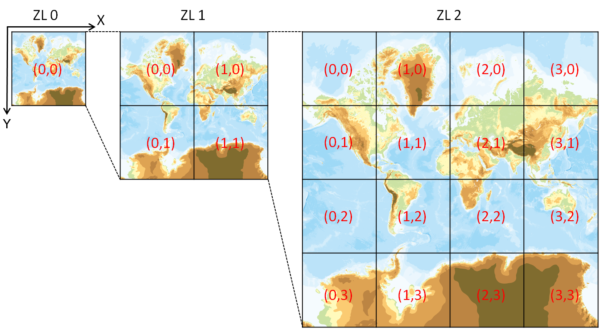

# gsiTile
国土地理院の地理院タイルを取得するPythonコードです。

## 地理院タイルとは
[地理院タイル](https://maps.gsi.go.jp/development/ichiran.html)は、[国土地理院](https://www.gsi.go.jp)が配信するタイル状の地図データです。
国土地理院のサーバから配信されたタイル状に分割された地図データが、 ブラウザやアプリ等の画面上に並べて表示されることで、利用者は地図を参照することができます。

## 地理院タイルの構成
地理院タイルは、以下のURLにアクセスすることにより取得することができます。
```
https://cyberjapandata.gsi.go.jp/xyz/{type}/{z}/{x}/{y}.{ext}
```
ここで、`{type}`はタイルの種類、`{z}`はタイルのズームレベル、`{x}, {y}`はタイルの座標番号、`{ext}`は画像ファイルの拡張子(png, jpg等)です。

### タイルの種類と拡張子
地理院タイルには、以下のような種類があり、それぞれ対応する`{type}`および`{ext}`を指定します。
| 種別       |  `{type}`       | `{ext}` |
|:---------:|:-----------------|:-------:|
| 標準地図    | `std`           | png     |
| 淡色地図    | `pale`          | png     |
| 白地図      | `blank`         | png     |
| 英語地図    | `english`       | png     |
| 空中写真    | `seamlessphoto` | jpg     |

### タイルのズームレベルと座標番号
ズームレベルは、タイルの詳細度を表す指標で、０〜１８の範囲で指定できます。
ズームレベル0は地球全体を含む256x256の画像であり、レベルが1上がるごとに含まれる範囲が縦横それぞれ1/2の同サイズの画像(解像度が縦横それぞれ
2倍)になります。`{z}`には取得するタイルのズームレベルを指定します。
また、`{x}, {y}`には左上のタイルを`(0, 0)`としたタイル番号を指定します。



「国土地理院 地理院タイルについて」より(https://maps.gsi.go.jp/development/siyou.html)

## 使用方法

### GSITileクラス
```
import gsiTile

# GSITileインスタンス作成
gsiTile = gsiTile.GSITile(lat0, lat1, lon0, lon1, tmpdir, level, ttype)
# lat0, lat1: [度, 分, 秒](DMS) または 度(DD)
# lon0, lon1: [度, 分, 秒](DMS) または 度(DD)
# tmpdir: 作業ディレクトリ(省略時='tmp')
# level: ズームレベル(省略時=16)
# ttype: タイルの種類(省略時='seamlessphoto')

# 地理院タイル取得(作業ディレクトリ配下にタイル画像が全て保存される)
gsiTile.getTiles()

# タイルの合成(作業ディレクトリ配下にある画像の結合とクロップ)
img = gsiTile.mergeImage()

# イメージファイルへの保存
gsiTile.saveImage(img, 'image.jpg')
```
